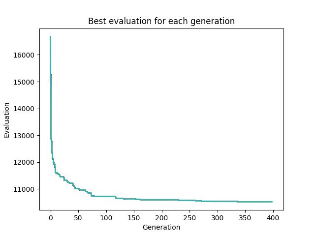

# ai-keyboard-generator

An evolution based AI that tries to generate a keyboard with the best possible layout for the swedish language.

This is a work in progress and might not work correctly.

## How it works

The AI is based on a genetic algorithm. The keyboard is represented as a string of characters. The fitness function is based on the distance between the characters.

The algorithm is based on the following steps:

1. Generate a population of keyboards.
2. Calculate the fitness of each keyboard based on a swedish dataset of random texts.
3. Select 10% of the best keyboards, breed some of the best 50% of keyboard, and add 40% of random keyboards to the population.
4. Repeat from step 2

## How to run

1. Create a virtual environment and install the requirements with `pip install -r requirements.txt`
2. Run the program with `python3 main.py -g <number_of_evolutions> -p <population_size>`

Type `python3 main.py -h` to get a list of commands.

## Results

### Generated keyboard

Here is the final generated keyboard from the image below. We can see that the letters in the middle row (the row where the fingers rest) are letters that are common.

```text
åtuch.bx,äd
 amislnoerkg
  jzövwpqfy
```

The 5 most common letters in the swedish alphabet are `a`, `e`, `t`, `n` and `r`, 4 of which are in the middle row.

### Image of a sample run



## Credits

The idea is based on the following youtube video: <https://www.youtube.com/watch?v=EOaPb9wrgDY>
