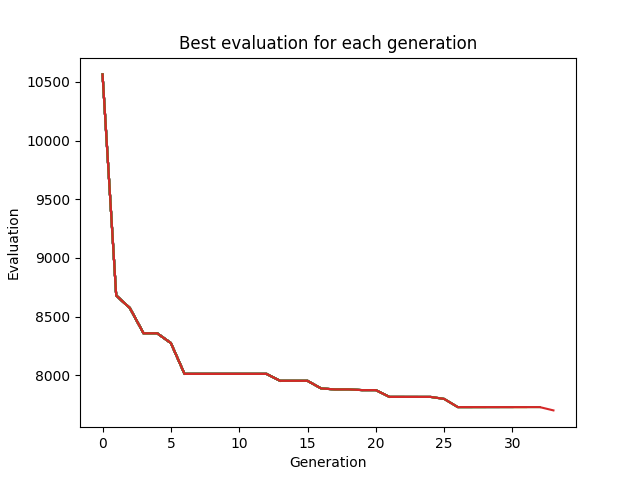

# ai-keyboard-generator

A evolution based AI that tries to generate a keyboard with the best possible layout for the swedish language.

This is a work in progress and might not work correctly.

## How it works

The AI is based on a genetic algorithm. The keyboard is represented as a string of characters. The fitness function is based on the distance between the characters.

The algorithm is based on the following steps:

1. Generate a population of keyboards.
2. Calculate the fitness of each keyboard.
3. Select 10% of the best keyboards, breed some of the best 50% of keyboard, and add 40% of random keyboards to the population.
4. Repeat from step 2

## Image of a sample run

